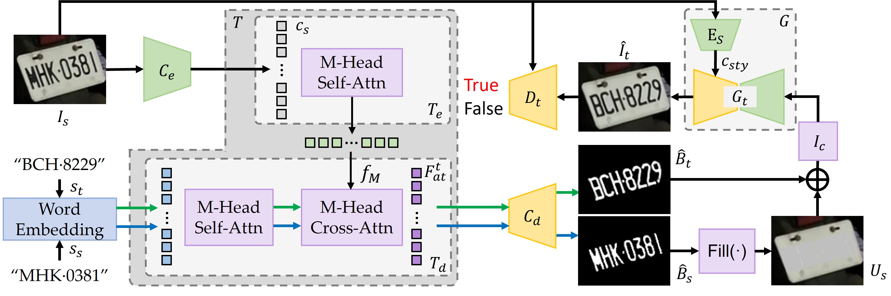

# Style-Preserving Generator to Make Synthetic License Plate Data

> **Abstract:** We propose the Style-Preserving Generator (SPG) to make synthetic license plate data and address the data imbalance and privacy issues when making a License Plate Recognition (LPR) model. The proposed SPG can edit the characters on real-world license plates while maintaining their original styles, enabling the generation of synthetic license plate data with user-specified characters. We can thus synthesize license plates with desired characters to effectively alleviate the data imbalance and privacy issues associated with real-world license plates. The SPG consists of several components: a transformer, a source encoder, a source style encoder, a character mask decoder, a target generator, and a target discriminator. Given a source license plate image and a specified text as inputs, these components are working together to compute the self- and cross-attention embeddings, predict character masks, and generate a synthetic license plate in the source style but with source characters replaced by the specified characters. We adopt a two-phase training scheme. Phase 1 involves using synthetic training data with ground-truth character masks available, followed by Phase 2 hybrid training using both synthetic and real-life data without the ground-truth character masks of the latter. To showcase the effectiveness of the SPG, we introduce a new benchmark dataset, namely the LP-2024 (License Plate 2024), which alleviates the limitations of existing datasets and presents new challenges for license plate recognition and generative models. We validate the SPG’s performance on the LP-2024 dataset and other benchmark datasets, and compare it against state-of-the-art text editing approaches.


# Getting Started
- Clone the repo:
```
git clone https://github.com/LP32343738/SPG.git
cd SPG
```
# Installation
- Python 3.7
- Pytorch 1.11.0
2. Install the requirements
```
pip install -r requirements.txt
```

# LP-2024 Dataset
We offer the LP-2024 Dataset for download.
[GDrive](https://drive.google.com/file/d/1ZmW0wFJZnvLamzdFMKWf8kiDqvlUGVGn/view?usp=sharing)


# Demo Pretrained Model
|Demo Pretrained Model|
|---|
|[GDrive](https://drive.google.com/drive/folders/1yHrOIKB0cttrDxHeAN5Yh8KOjGy3CNHy?usp=sharing)|

Please place the checkpoint files in the `./` directory.

# Inference
```
python predict.py --input_dir=i_s --input_text=gt.txt --checkpoint=./train_step-xxxxx.model.model
```
You can use `demo_cam.py` for a camera demo, or `demo_video.py` for a video demo. Additionally, we also offer a UI method using `demo_ui.py`.

# Validation
## Download the Test Lists.
Please download the test lists for each dataset. Note that you will need to change the paths accordingly.

## Validation Pretrained Models
The pretrained models for MPIE-LP, Voxceleb1, and Voxceleb2-LP can be downloaded from the following links.
|Pretrained Models|
|---|
|[MPIE-LP](https://drive.google.com/drive/folders/1LtU6YMu6OK2MI4d7s7pFiMJsEc7r_FN1?usp=sharing)|
|[Voxceleb1](https://drive.google.com/drive/folders/1QPcTccAXWvdpZGfm5knLZm_GkyBD9tZw?usp=sharing)|
|[Voxceleb2-LP](https://drive.google.com/drive/folders/19Ig7NMdU9tbWEea3fzV_USu71nvUROPA?usp=sharing)|

Please place the models for different datasets in the `./experiment` directory.

## Generate the Test Samples
Next, You can use `test_sample_mpie.py`, `test_sample_vox1.py`, and `test_sample_vox2.py` to generate test samples for each respective dataset. The generated images will be placed in the `./expr/eval` directory.

```
python test_sample_mpie.py
python test_sample_vox1.py
python test_sample_vox2.py
```

## Use PAE and ArcFace to Test CSIM
After generating the test samples, you can use `mean_pae_csim.py` and `mean_arcface_csim.py` to test CSIM. Please download the PAE pretrained model and the ArcFace pretrained model from the following links, and extract them directly to start testing.

|Backbone|
|---|
|[PAE](https://drive.google.com/file/d/1zU1YTRstgrdJ7hwjl9CVjgFnNAyNFLZS/view?usp=sharing)|Unzip it and place it into the data directory|
|[ArcFace](https://drive.google.com/file/d/10RPCyfVHWuCOLb7RPN3YAJ0KnYITDCgZ/view?usp=sharing)|Unzip it and place it into the main directory|

```
python mean_pae_csim.py
python mean_arcface_csim.py
```
    
